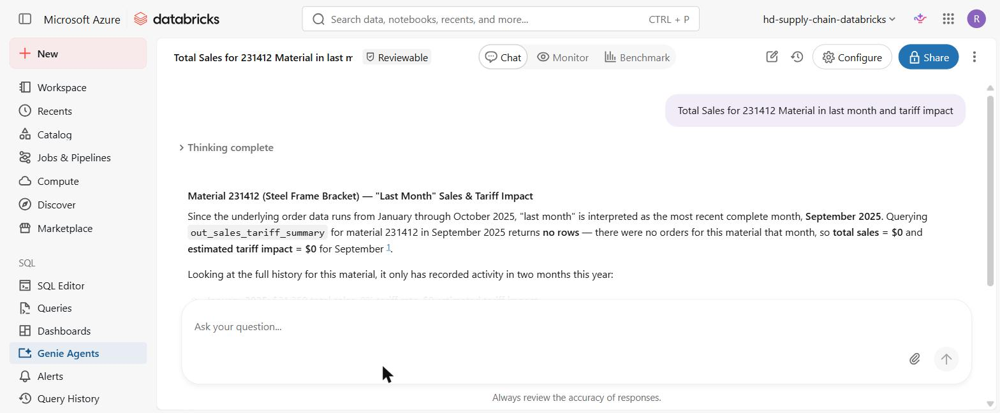
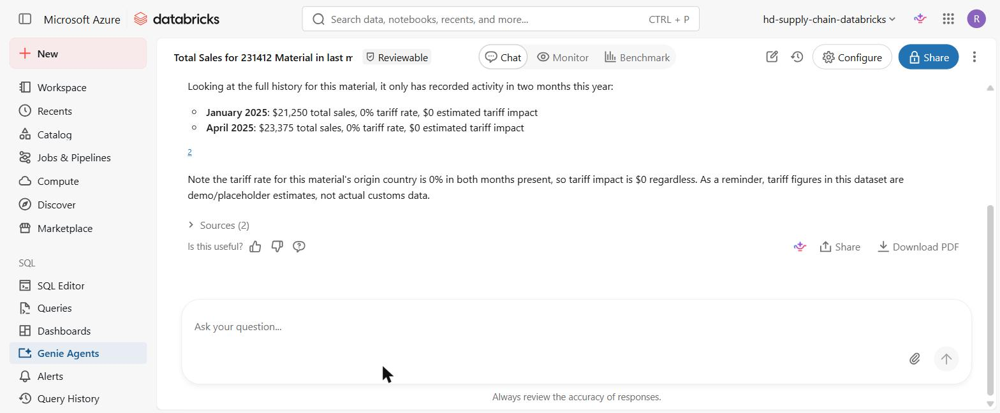
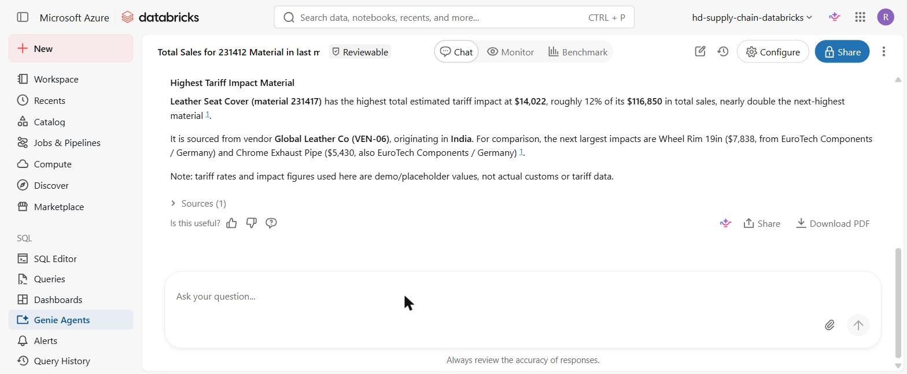
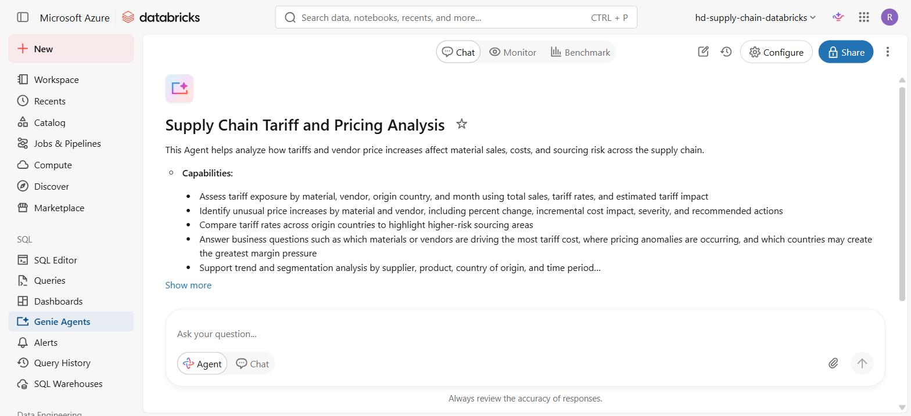
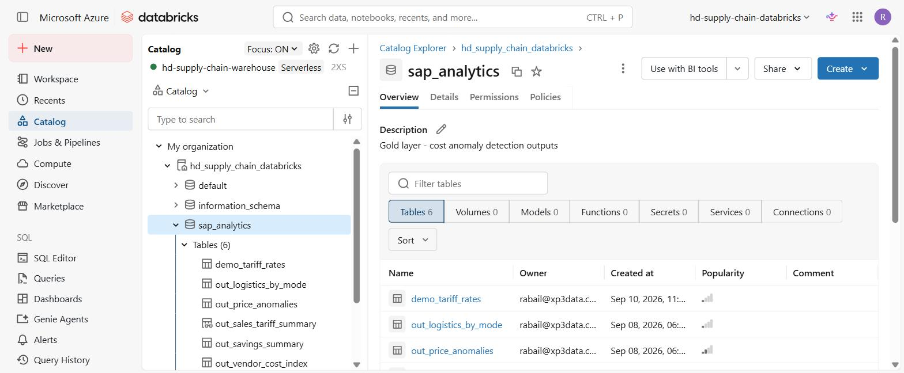

# Supply Chain Tariff & Pricing Analysis — Natural Language BI Agent

A working prototype that lets a non-technical business user (e.g. a VP or
operations lead) ask plain-English questions about supply chain sales,
vendor cost, and tariff exposure, and get an accurate, data-grounded
answer back, built on **Databricks Genie**, Unity Catalog, and a
lakehouse-style bronze/gold data model.

> **Note on the data:** this project uses demo/synthetic supply chain data
> (fictional materials, vendors, and purchase orders) and placeholder
> tariff rates. It's built to demonstrate the *pattern* a real
> deployment would plug in an actual tariff/customs data source in place
> of `demo_tariff_rates`.

## The problem

A supply chain team wanted to be able to ask questions like:

> "Total Sales for material 231412 in the last month and tariff impact"

... and get a real, trustworthy answer, without writing SQL, without
opening a dashboard, and without a data analyst in the loop for every
question. The catch: the two things being asked about (sales and tariff
cost) lived in different shapes across the data, and there was no
tariff data source connected yet.

## What this project builds

1. **A bronze → gold lakehouse layer in Unity Catalog** raw SAP-style
   source tables (`purchase_orders`, `material_master`, `vendor_master`,
   `price_history`, `logistics_shipments`) feeding curated gold outputs
   (`out_price_anomalies`, `out_vendor_cost_index`, `out_savings_summary`,
   and the view built here, `out_sales_tariff_summary`).
2. **A demo tariff rate table** (`demo_tariff_rates`) and a pre-joined,
   pre-aggregated gold view (`out_sales_tariff_summary`) that combines
   real purchase order data with tariff rates by vendor country, so the
   downstream AI agent doesn't have to reconstruct multi-table joins on
   every question.
3. **A Databricks Genie Agent** ("Supply Chain Tariff and Pricing
   Analysis") connected to that view plus supporting tables, configured
   with explicit general instructions covering:
   - what "total sales" and "tariff impact" mean in business terms
   - a clear disclosure that tariff figures are demo/placeholder data
   - how to interpret relative dates ("last month") against a fixed
     historical dataset instead of guessing or hallucinating

## Why this is harder than "just add a chatbot"

The interesting engineering problem here isn't the chat UI, Genie
provides that. It's making sure the agent:

- **never fabricates data it doesn't have.** When asked about "last
  month" and there are zero matching rows, the agent explicitly says so
  and falls back to showing the material's real order history instead
  of inventing a number.
- **is transparent about data quality.** Every tariff-related answer
  states, in-line, that the tariff rates are placeholder values — so a
  business user can't mistake a prototype number for a real one.
- **reasons correctly across joined tables** (sales × vendor × country ×
  tariff rate) rather than just running a lookup.

## Example interactions

**Q: "Total Sales for 231412 Material in last month and tariff impact"**

The agent correctly determines the dataset's most recent complete month,
finds there are no orders for that specific material in that month,
states that plainly (rather than guessing), and then surfaces the
material's actual order history instead:

**Q: "Which material has the highest total tariff impact, and which vendor
and country does it come from?"**

**The Genie Agent's configured capabilities:**

**The underlying Unity Catalog data model:**

## Tech stack

- **Databricks** (Azure), Unity Catalog, SQL Warehouses (serverless),
  Genie Agents
- **SQL** table/view definitions, data modeling (see [`/sql`](./sql))
- Natural language configuration — see
  [`genie_instructions.md`](./genie_instructions.md) for the exact
  instructions given to the agent

## What I'd do next with real data

- Replace `demo_tariff_rates` with an actual tariff/customs data feed
  (by HS code and country of origin, ideally at the material level
  rather than just vendor country)
- Add curated example questions and example SQL pairs in Genie's
  "Examples" tab to further improve accuracy on ambiguous phrasing
- Add row-level access controls if this were rolled out beyond a single
  VP stakeholder
